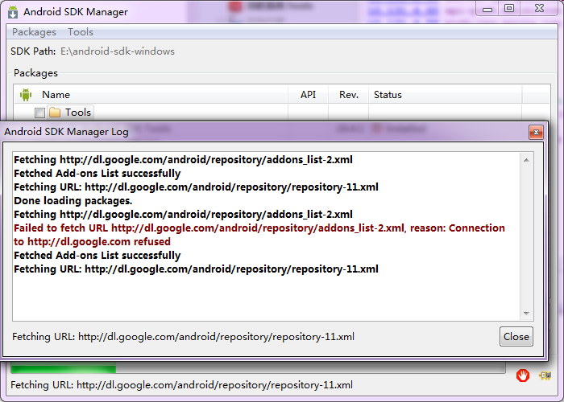
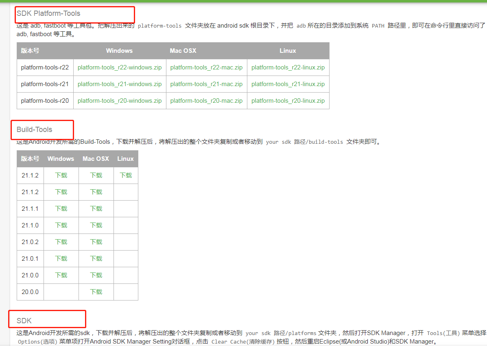

# 一 下载解压sdk

SDK 下载链接：http://tools.android-studio.org/index.php/sdk


目录如下，双击 SDK Manager.exe ：


## 1. 下载所需要的插件：

如果不选这三个可以自己去下载，比较麻烦。


选择Android版本：


usb驱动，可以使用真机：


## 2. install安装

勾选协议：


## **3. 等待安装**

确保网络良好


安装完成


目录多了很多工具：


如果开发需要用到其他插件，同样你可以再打开 SDK Manager.exe 安装你需要的插件


如果你被墙了，出现下图，无法下载。



那么只能去这里单独下载了：https://www.androiddevtools.cn/

按照提示下载即可



其实使用 SDK Manager.exe 就是一键帮你安装。

# 二 配置SDK环境变量

## **1. 新建环境变量 ANDROID_HOME**

ANDROID_HOME 为SDK安装目录

## **2.**修改path 

在path变量后面追加

```xml
;%ANDROID_HOME%\platform-tools;%ANDROID_HOME%\tools;%ANDROID_HOME%\build-tools\29.0.3
```

%ANDROID_HOME%\build-tools\29.0.3 这个环境变量要根据自己安装build-tools的版本修改

如果是win10则分行写：


## **3.**cmd测试


注意，高版本的是 

```c
adb veriosn
```

低版本是

```
adb -veriosn
```


# 三 安装Android Studio

Android studio下载链接：http://www.android-studio.org/

Android studio分安装版（.exe文件）和解压版（解压版解压直接就可以使用）

我是直接从官网下载的：https://developer.android.google.cn/studio/

安装：


第二个勾勾是选择是否安装虚拟机，虚拟机是用来调试的，如果你有模拟器或者用真机调试，可以不安装。

安装完就可以下一步了，


安装完成。


**修改配置路径**

Android Studio安装好后会在系统盘用户目录下产生这几个文件夹
`.android`是Android SDK生成的AVD（Android Virtual Device Manager）即模拟器存放路径
`.AndroidStudio3.6`是Android Studio的配置文件夹，主要存放一些Android Studio设置、插件、项目的缓存信息
`.gradle`是构建工具Gradle的配置文件夹，也会存储一些项目的构建缓存信息


**你可以跳过下面这步，我的目的是为了方便管理配置文件，不占用C盘，配置文件默认是放在了C盘，**

打开AndroidStudio的安装目录的配置文件：


修改这两个配置:


注意是 `/` 不是` \`


打开AndroidStudio 


选择自定义安装，可以指定jdk，sdk，gradle安装目录：


选择jdk：


选择代码风格：


自动检测到了SDK，否则需要自己指定或者在这里安装：

Android SDK 自带模拟器一直以慢、卡顿著称，而英特尔的 HAXM 技术（Hardware Accelerated Execution Manager）使用基于 Intel(R) Virtualization Technology (VT) 的硬件加速，实现 Android 模拟器加速。具体的硬件要求和安装方式大家可以去官网查看。一般在下载安装 SDK 的时候，会默认帮你安装开启 HAXM


这一步HAXM可能安装失败，不过不影响，可以参考下面的博客重新安装。


参考：

gradle安装：https://blog.csdn.net/yao_94/article/details/81211528

修改默认配置：https://blog.csdn.net/weixin_43465312/article/details/90081227

HAXM重装：https://www.jianshu.com/p/7be97678aa8b

