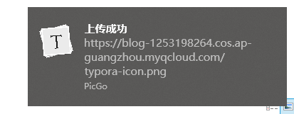

以前用typora写博客文章的时候，要黏贴图片的时候，图片只能放在本地，假如你要复制黏贴到其他博客，或者把真个md文件上传到github，又或者改了路径，图片都会失效：

近期看到typora 0.9.84版本升级说支持PicGo了，有了PicGo就可以把本地的图片上传到云了:

下面是我typora+PicGo进行整合：

## 1. 下载PicGo

版本要2.2以上，因为github下载很慢，文章结尾我附带了网盘下载链接。

下载完成进行安装：

设置你的云服务存储，我使用的是腾讯云，腾讯云的cos云存储很便宜，1年低频储存20G 比一份快餐的钱都便宜

购买地址：https://cloud.tencent.com/product/cos

购买了之后，到控制台就可以新建储存桶了：

配置了存储桶后，点击秘钥管理 配置一下PicGo 就可以了：

PicGo 相册还可以管理你的图片：

## 2. 安装typora 版本最低要0.9.84

点击 文件 ， 偏好设置 ， 图像 

找到你本地安装的PicGo安装目录的.exe文件

测试一下是否上传成功：

可以在腾讯云找到你刚刚上传的图片：

## 3. 使用

配置完成上面连个以后，可以把图片直接拖到typora或者截图黏贴：

最后右击 上传图片 即可，你会发现图片的URL就变成了你的云存储的URL了。

这样你就可以使用自己的图床了！

picgo和typora安装包戳下面链接：

链接: https://pan.baidu.com/s/1RRNjkJXsjqoHzZSdDwFx0g 提取码: 94r1